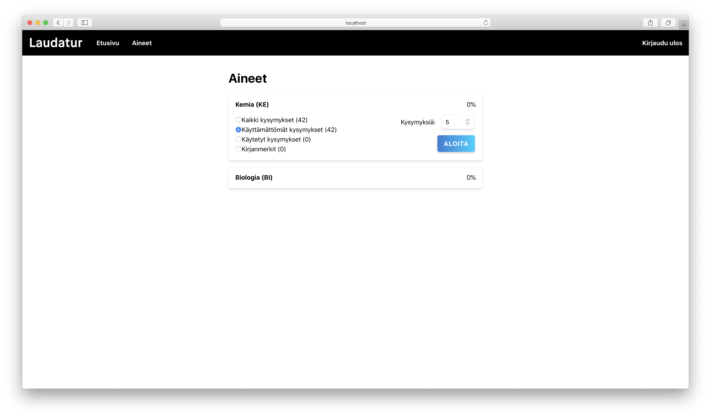
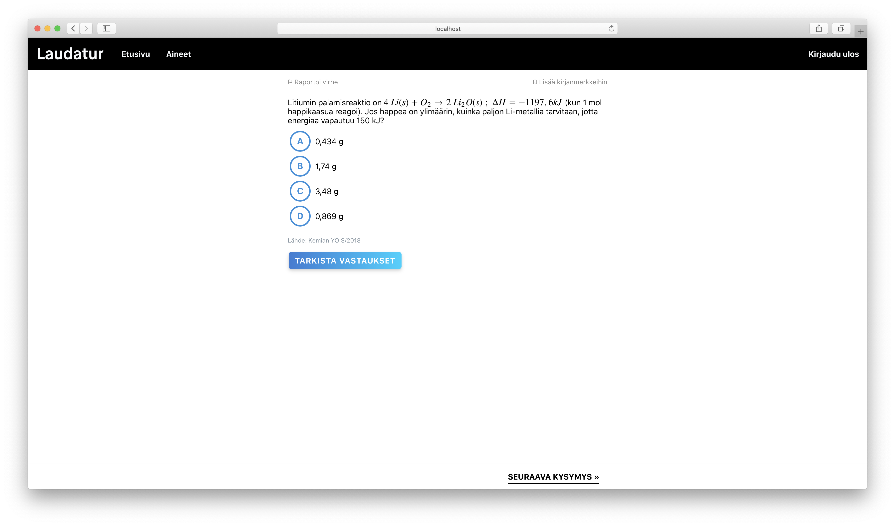
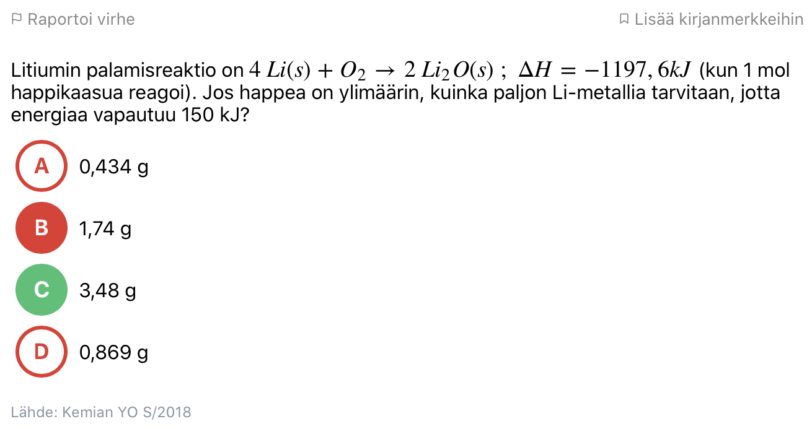
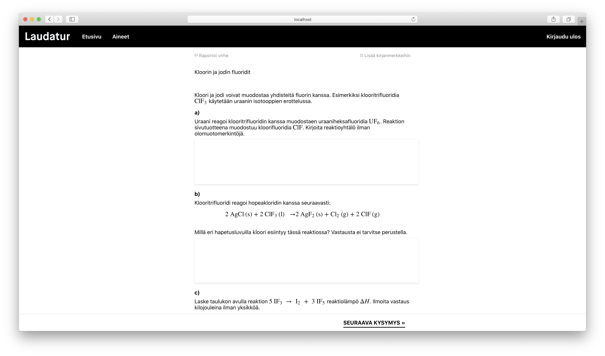
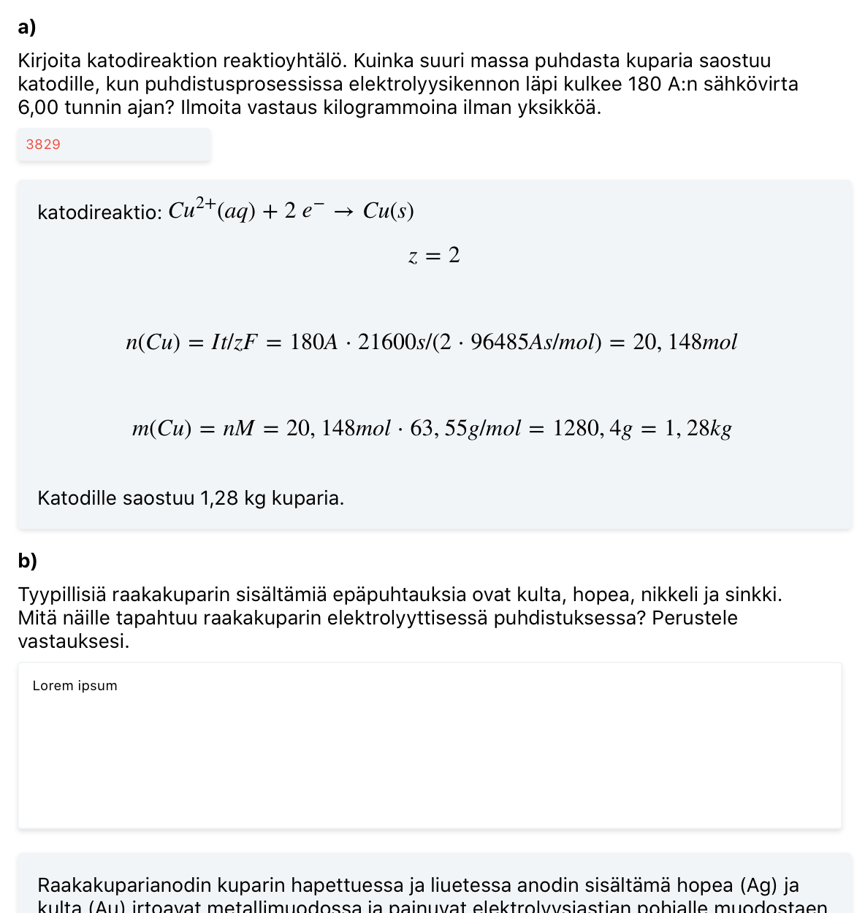
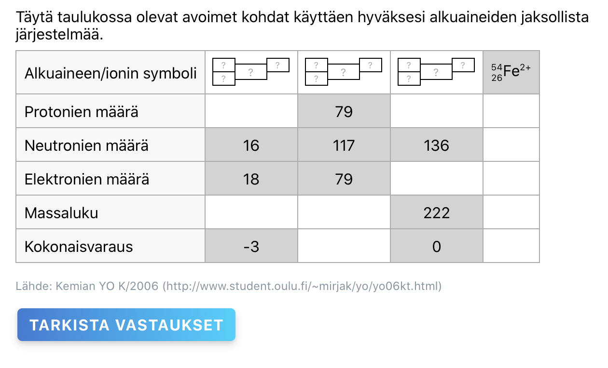
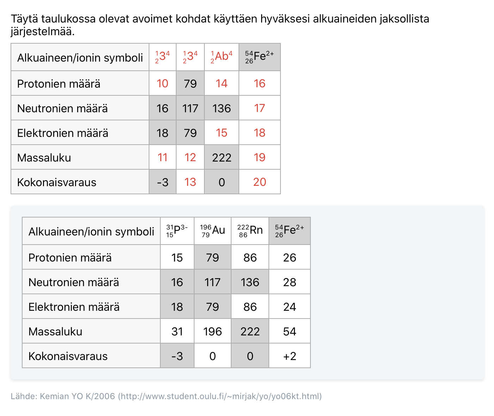

# Laudatur

This is the frontend for Laudatur, a platform for practicing to the Finnish matriculation exams. Question types include freeform texts, fillable tables, balanced chemistry equations, multiple choice answers, and number inputs. Most questions are fully automatically checked, except for the freeform answer field that shows an example answer to compare with.

## Screenshots

